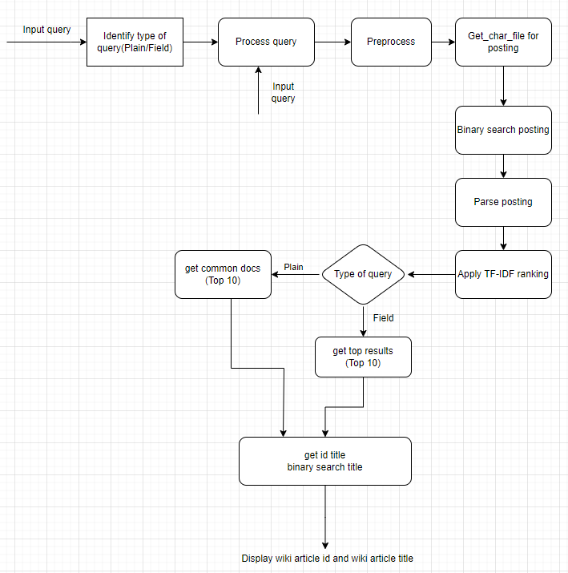
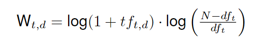

# English Wikipedia Search Engine

[](search_engine_streamlit.mkv)

## Overview

This project presents an end-to-end information retrieval system developed using the English Wikipedia dump, a dataset of approximately 100GB in size encompassing nearly 22 million wiki pages. The system's core functionality supports two types of queries: Plain queries and Field queries. The primary goal is to provide the top 10 relevant Wikipedia article titles for a given query. The project unfolds in two key stages: Index Creation and Search Operation.

### Plain query examples:

- Lionel Messi
- Barcelona
- Virat Kohli
- Raj Reddy

### Support for field queries:

Fields include Title, Infobox, Body, Category, Links, and References of a Wikipedia page.

### Field query examples:

- t:World Cup i:2018 c:Football – search for "World Cup" in Title, "2018" in Infobox, and "Football" in Category

## Stage 1: Index Creation

The initial stage of the project focuses on efficiently creating the index file, which is pivotal for retrieving a list of article titles relevant to a given query. This stage involves the following steps:

1. **Parsing:** The XML dump is parsed using an xml.sax parser to extract field-wise information.
2. **Preprocessing:** Text is standardized by converting it to lowercase, replacing non-ASCII characters with spaces, tokenizing the text, removing stop words, and applying stemming to obtain word roots.
3. **Inverted Index Creation:** An inverted index is created, listing words and their corresponding posting lists. This data is stored in multiple index files. The procedure is explained below.

*Example of the index file format*:

```
sachin:d1-t1c2b7|d5-t1
tendulkar:d1-t1b1|d6-c1b1

```

- **Index Size Constraint:** The index size is limited to a maximum of one-fourth of the original dump size (100GB), making the index size less than 25GB. The created index size is 15.1GB and it has nearly 14 Million words in it.
- To optimize computational load and search efficiency, multiple intermediate files were generated. Index creation for this large dump took approximately 10 hours.
- Initially, 46 inverted index files and 46 id_to_title files were created, containing word-posting lists and article IDs with their titles.
- The 46 id_to_title files were combined into a single id_to_title file, sorted by article ID.
- Character-wise files were generated from the 46 inverted index files, resulting in 26 files for the letters A to Z and 10 files for digits 0-9.
- Final character-wise files were created, each containing unique words and their posting lists. This process was also applied to digit-wise files.
- To manage computational load and search efficiency, each character-wise file was split into 101 smaller files. For example, `token_a.txt` was split into `token_a_1.txt`, `token_a_2.txt`, and so on. This resulted in a total of 2626 character-wise files.
- Character-wise info files were generated for the 26 character-wise files, containing the first words of the corresponding 101 character-wise files.
- The single id_to_title file was split into 101 id_to_title files. Additionally, an `id_title_info.txt` file was created, listing the last words of all 101 id_to_title files.
- In total, there are 2764 index files, including 2626 character-wise files, 26 character-wise info files, 10 digit-wise files, and one `id_to_title_info` file.

## Stage 2: Search Operation

The system is expected to output relevant Wikipedia page titles in response to plain or field queries in less than 10 seconds. Below is the flowchart of the search operation, along with a detailed description of each module.


### Modules Description

1. **Identify Type of Query**: This function is responsible for identifying whether the query is a plain query or a field query.

2. **Process Query**: This function executes a series of other functions, including preprocessing, get_char_file_for_posting, binary_search_posting, and parse_posting. It returns a dictionary with the following structure. For example, here is the output for the query `t:virat kohli`:

    ```python
    defaultdict(<class 'dict'>, {'virat': {'t': {'16017429': 1, '21987751': 1, '35009332': 1, '32': 1, '555143': 1, '949199': 1}}, 'koh': {'t': {'16966': 1, '235565': 1, '286311': 1, ...}})
    ```

    - The keys of the dictionary are the individual words present in the query.
    - For each word, there is a sub-dictionary containing field-specific information. In this case, the 't' field represents the "title" field.
    - Within the 't' field sub-dictionary, document IDs are used as keys, and the values associated with these document IDs are the frequencies of the word occurrences in the "title" field of the respective documents.

3. **Get Char File Posting**: The purpose of this function is to efficiently locate a specific line within a file by performing a binary search based on the token. It takes a token as input and returns one of the inverted index file IDs from the 2764 files, which will contain the given token and its posting list.

4. **Binary Search Posting**: This function performs binary search in the above returned file and returns the posting list for the given token/word.

5. **Parse Posting**: This function reformats the posting list into the desired format.

6. **Apply TF-IDF Ranking**: This function applies TF-IDF ranking and assigns a relevance score to each document. The intuition behind TF-IDF is that terms that appear often in a document should have high weights, and terms that appear in many documents should have low weights.

    

    ```
    weightage_dict = {'t': 1.0, 'b': 0.6, 'c': 0.4, 'i': 0.75, 'l': 0.20, 'r': 0.25}

    score = weightage_dict * W_{t,d}
    ```

    Finally, this function returns a dictionary like the one below. '49373197' is the document ID, and 24.38 is the relevance score.

    ```python
    {'virat': {'t': {'49373197': 24.38534791343279, '41780702': 24.38534791343279, '16017429': 24.38534791343279}}
    ```

7. **Get Top 10 Docs**: This function returns the top 10 document IDs sorted based on the relevance scores.

8. **Get ID Title and Binary Search Title**: The first function, `get_id_title`, is responsible for locating the correct `id_to_title` index file. In the second function, binary search is applied to get the wiki title for a given document ID in the previously returned `id_to_title` index file.

Finally, the top 10 Wikipedia article titles are displayed. For more details, you can explore the code files: `Index.py` and `Search.py`.
